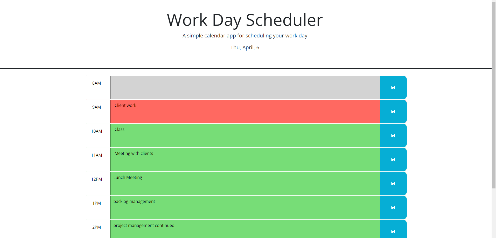

# work day scheduler


## Technology Used 

| Technology Used         | Resource URL           | 
| ------------- |:-------------:| 
| HTML    | [https://developer.mozilla.org/en-US/docs/Web/HTML](https://developer.mozilla.org/en-US/docs/Web/HTML) | 
| CSS     | [https://developer.mozilla.org/en-US/docs/Web/CSS](https://developer.mozilla.org/en-US/docs/Web/CSS)      |   
| Javascript    | [https://developer.mozilla.org/en-US/docs/Web/javascript](https://developer.mozilla.org/en-US/docs/Web/javascript)      |   
| Git | [https://git-scm.com/](https://git-scm.com/)     |   

## Description

[Deployed Site](https://didriklindberg.github.io/work_day_scheduler/)

The work day scheduler is an online tool that helps users plan and organize their day-to-day activities. It displays the current date at the top of the page and uses color coding to show whether a particular time block has passed, is currently ongoing or will occur in the future. Users can enter a description of their activity for each time block and save it to the browser's local storage. The app then retrieves the saved activities from local storage and displays them on the page for future reference.




## function examples

the follwing example function is responsible for dynamically updating the html class which controls the css styling which indicates if a timeblock is in the past/present/future. the function iterates over each timeblock and compates to the current hour (extracted with dayjs)

```java
  // forloop that iterates over each timeblock and compares the id to the current hour
  // if the id is less than the current hour, add the class past/present/future
  document.querySelectorAll('.time-block').forEach(function (timeBlock) {
    var timeBlockHour = parseInt(timeBlock.id.split('-')[1]);
    if (timeBlockHour < currentHour) {
        timeBlock.classList.add('past');
        console.log('past');
    } else if (timeBlockHour === currentHour) {
        timeBlock.classList.add('present');
        console.log('present');
    } else {
        timeBlock.classList.add('future');
        console.log('future');
    }
});

````


The following functions are resposnible for saving the description values to local storage and then rendering them to the page.


```Java
  // create a click event listener for the save button and save the description to local storage
  $('.saveBtn').on('click', function () {
    var timeBlock = $(this).parent();
    var timeBlockHour = timeBlock.attr('id').split('-')[1];
    console.log(timeBlockHour);
    var description = timeBlock.children('textarea').val();
    console.log(description);
    localStorage.setItem(timeBlockHour, description);

});

  // function that render the description from local storage to the page
  function renderDescription() {
    //loop ththough each timeblock and get the id
    $('.time-block').each(function () {
     //get the timeblock id
     var timeBlockHour = $(this).attr('id').split('-')[1];
     //get the description from local storage that matches the timeblock id
     var description = localStorage.getItem(timeBlockHour);
     //set the description to the textarea
     if (description !== null) {
         $(this).children('textarea').val(description);
     }
      });
 }
 renderDescription();
````


## Learning Points 
Before this project I had not used dayjs before, or storing and rendering values to and from localstorage. This was a great project for first exposure to these tools.

## Credits/Resources used
- [Day.js Docs](https://day.js.org/)
- [Jquery Docs](https://jquery.com/)

 ### Find my


- [Portfolio](https://didriklindberg.github.io/Portfolio-Site) 
- [Github](https://github.com/DidrikLindberg)


